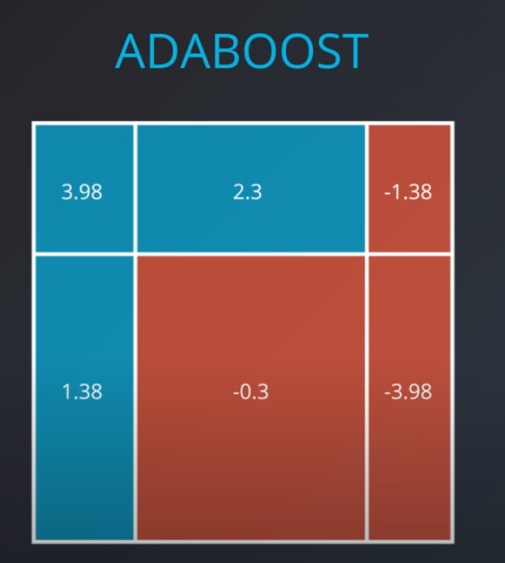
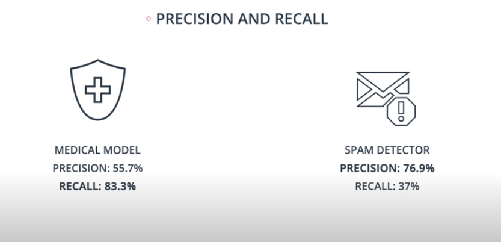

# Intro to Machine Learning with TensorFlow Nanodegree Program

## Supervise Learning

### Lesson 1

* Learning from labelled data

* Supervised learning can be divided in two models
    * Classification
        * Categorical Outcomes
        * Any number of categories 
        * Type of Dog

    * Regression
        * Numeric Outcomes
        * A persons height for example
    
* Unsupervised Learning
    * No labelled data
    * Grouping similar items 

* Reinforcement Learning
    * Training algorithms that take rewards based on actions
    * Game playing agents 

* 

### Lesson 2

### Linear Regression

* Linear Regression
    * Draw the best fitting line to it

    *  

    * Absolute Trick 
        * `p`: Horizontal
        * `q`: Vertical
        * `w1`: Slop
        * `w2`: Y intercept 

        * 

        * 

        * We want to take tiny steps, so lets multiple this by a small number (learning rate)

        * 

        * If the point is not on top of the line, but actually underneath we will subtract instead of sum

        * 


        * The fact we `p` is connected with the position of our point. If the point is on the right `w1` will move the slop up, but if `p` is negative `w1` will be moved down

        * 

        * Also, if the point distance is small (meaning `p` is small), we will add a small value to our slop. However, if `p` is large we will add a large number to the slop 

        * 

        * 


        * Great job! Since the point is below the line, the intercept decreases; since the point has a negative x-value, the slope increases.

            *  

            *  


    * Square Trick 

        * 

        * 

        * Besides moving the slop `w1` horizontally (`p` value) we will also take `(q-q')` in order to account to the vertical axis

        *  
    
    * Gradient Descent

        * Minimizing the error

        * 
    
    * Error Functions

        * Mean Absolute Error

            *   

            *   

                * Sum of all errors divided by `m` which is the number of data points
            
            *   

                * We take the absolute value so we don't cancel positive errors with negative errors in our data set
        
        * Mean Square Error

            *  

            *  

                * This is always gonna be a positive error since we are taking the square of it
            
            *  
        
        * Minimizing Error Functions

            *  

                * The tricks we saw before are really similar to our current derivative. Check the tricks again and you will see that `(y - y')x` is part of the trick.
            
            *  

            * 

                * This is exactly what this gradient descent step is doing. Multiplying `(y - y')x` by a learning rate 
            
            * 

            * 
    
    * Batch vs Stochastic Gradient Descent

        * At this point, it seems that we've seen two ways of doing linear regression.

            * By applying the squared (or absolute) trick at every point in our data one by one, and repeating this process many times.

            * By applying the squared (or absolute) trick at every point in our data all at the same time, and repeating this process many times.
        
        * More specifically, the squared (or absolute) trick, when applied to a point, gives us some values to add to the weights of the model. We can add these values, update our weights, and then apply the squared (or absolute) trick on the next point. Or we can calculate these values for all the points, add them, and then update the weights with the sum of these values.

        * The latter is called **batch gradient descent. The former is called stochastic gradient descent.**

        * 

        * The question is, which one is used in practice?

        * Actually, in most cases, neither. Think about this: If your data is huge, both are a bit slow, computationally. The best way to do linear regression, is to split your data into many small batches. Each batch, with roughly the same number of points. Then, use each batch to update your weights. This is still called **mini-batch gradient descent**.

        * 
    
    * Mini-Batch Gradient Descent Quiz

        * In this quiz, you'll be given the following sample dataset (as in data.csv), and your goal is to write a function that executes mini-batch gradient descent to find a best-fitting regression line. You might consider looking into numpy's `matmul` function for this!

        * ```python
            def MSEStep(X, y, W, b, learn_rate = 0.001):
            """
            This function implements the gradient descent step for squared error as a
            performance metric.
            
            Parameters
            X : array of predictor features
            y : array of outcome values
            W : predictor feature coefficients
            b : regression function intercept
            learn_rate : learning rate

            Returns
            W_new : predictor feature coefficients following gradient descent step
            b_new : intercept following gradient descent step
            """
            
            # compute errors
            y_pred = np.matmul(X, W) + b
            error = y - y_pred
            
            # compute steps
            W_new = W + learn_rate * np.matmul(error, X)
            b_new = b + learn_rate * error.sum()
            return W_new, b_new
            ```

    * Linear Regression with scikit-learn

        * In this section, you'll use linear regression to predict life expectancy from body mass index (BMI). Before you do that, let's go over the tools required to build this model.

        * For your linear regression model, you'll be using scikit-learn's LinearRegression class. This class provides the function fit() to fit the model to your data.

        * ```python
            >>> from sklearn.linear_model import LinearRegression
            >>> model = LinearRegression()
            >>> model.fit(x_values, y_values)
            ```

        * Fitting the model means finding the best line that fits the training data. Let's make two predictions using the model's predict() function.

        * ```python
            >>> print(model.predict([ [127], [248] ]))
            [[ 438.94308857, 127.14839521]]
            ```

        * The model returned an array of predictions, one prediction for each input array. The first input, [127], got a prediction of 438.94308857. The second input, [248], got a prediction of 127.14839521. The reason for predicting on an array like [127] and not just 127, is because you can have a model that makes a prediction using multiple features. We'll go over using multiple variables in linear regression later in this lesson. For now, let's stick to a single value.

        * ```python
            # TODO: Add import statements
            import pandas as pd
            from sklearn.linear_model import LinearRegression

            # Assign the dataframe to this variable.
            # TODO: Load the data
            bmi_life_data = pd.read_csv("bmi_and_life_expectancy.csv")

            # Make and fit the linear regression model
            #TODO: Fit the model and Assign it to bmi_life_model
            bmi_life_model = LinearRegression()
            bmi_life_model.fit(bmi_life_data[['BMI']], bmi_life_data[['Life expectancy']])

            # Mak a prediction using the model
            # TODO: Predict life expectancy for a BMI value of 21.07931
            laos_life_exp = bmi_life_model.predict(21.07931)
            ```
        
    * Multiple Linear Regression

        * In the last section, you saw how we can predict life expectancy using BMI. Here, BMI was the predictor, also known as an independent variable. A predictor is a variable you're looking at in order to make predictions about other variables, while the values you are trying to predict are known as dependent variables. In this case, life expectancy was the dependent variable.

        * Now, let’s say we get new data on each person’s heart rate as well. Can we create a prediction of life expectancy using both BMI and heart rate?

        * Absolutely! As we saw in the previous video, we can do that using multiple linear regression.

        * If the outcome you want to predict depends on more than one variable, you can make a more complicated model that takes this into account. As long as they're relevant to the situation, using more independent/predictor variables can help you get a better prediction.

        * When there's just one predictor, the linear regression model is a line, but as you add more predictor variables, you're adding more dimensions to the picture.

        * When you have one predictor variable, the equation of the line is

        * y = mx + b

        * and the plot might look something like this:

        *  

        * Adding a predictor variable to go to two predictor variables means that the predicting equation is:

        * y = m_1 x_1 + m_2 x_2 + b

        * To represent this graphically, we'll need a three-dimensional plot, with the linear regression model represented as a plane:

        *  

        * You can use more than two predictor variables - in fact, you should use as many as is useful! If you use nn predictor variables, then the model can be represented by the equation

        * y=m1x1+ m2x2 +m3x3+ ... + mnxn +b

        * As you make a model with more predictor variables, it becomes harder to visualise, but luckily, everything else about linear regression stays the same. We can still fit models and make predictions in exactly the same way - time to try it!

        * ```python
            from sklearn.linear_model import LinearRegression
            from sklearn.datasets import load_boston

            # Load the data from the boston house-prices dataset 
            boston_data = load_boston()
            x = boston_data['data']
            y = boston_data['target']

            # Make and fit the linear regression model
            # TODO: Fit the model and Assign it to the model variable
            model = LinearRegression()
            model.fit(x, y)

            # Make a prediction using the model
            sample_house = [[2.29690000e-01, 0.00000000e+00, 1.05900000e+01, 0.00000000e+00, 4.89000000e-01,
                            6.32600000e+00, 5.25000000e+01, 4.35490000e+00, 4.00000000e+00, 2.77000000e+02,
                            1.86000000e+01, 3.94870000e+02, 1.09700000e+01]]
            # TODO: Predict housing price for the sample_house
            prediction = model.predict(sample_house)
            ```

    * Linear Regression Warnings

        * Linear regression comes with a set of implicit assumptions and is not the best model for every situation. Here are a couple of issues that you should watch out for.

        * **Linear Regression Works Best When the Data is Linear**

        * Linear regression produces a straight line model from the training data. If the relationship in the training data is not really linear, you'll need to either make adjustments (transform your training data), add features (we'll come to this next), or use another kind of model.

        *  


        * Linear Regression is Sensitive to Outliers

        * Linear regression tries to find a 'best fit' line among the training data. If your dataset has some outlying extreme values that don't fit a general pattern, they can have a surprisingly large effect.

        * In this first plot, the model fits the data pretty well.

        *  

        * However, adding a few points that are outliers and don't fit the pattern really changes the way the model predicts.

        * 

* Polynomial Regression

    * 

        * In order to represent this line we will need a polynomial equation

        * This will work the same way as the Linear Regression, but with more weights 

        * 

        * The algorithm is the same thing, we take the mean absolute error or mean squared error, and take the derivative to the respect of the 4 variables and use gradient descent to modified this 4 weights in order to minimize the error.
    
    * Get some practice implementing polynomial regression in this exercise. In data.csv, you can see data generated for one predictor feature ('Var_X') and one outcome feature ('Var_Y'), following a non-linear trend. Use sklearn's PolynomialFeatures class to extend the predictor feature column into multiple columns with polynomial features. Play around with different degrees of polynomial and the Test Run button to see what fits best: when you think you have the best-fitting degree, press the Submit button to check your work!

    * ```python
        # TODO: Add import statements
        import numpy as np
        import pandas as pd
        from sklearn.linear_model import LinearRegression
        from sklearn.preprocessing import PolynomialFeatures

        # Assign the data to predictor and outcome variables
        # TODO: Load the data
        train_data = pd.read_csv('data.csv')
        X = train_data['Var_X'].values.reshape(-1, 1)
        y = train_data['Var_Y'].values

        # Create polynomial features
        # TODO: Create a PolynomialFeatures object, then fit and transform the
        # predictor feature
        poly_feat = PolynomialFeatures(degree = 4)
        X_poly = poly_feat.fit_transform(X)

        # Make and fit the polynomial regression model
        # TODO: Create a LinearRegression object and fit it to the polynomial predictor
        # features
        poly_model = LinearRegression(fit_intercept = False).fit(X_poly, y)
        ```
    
    * 

* Regularization

    * This concept works for both regression and classification

    * 

    * 

    * If we train a model to minimize error we will elect the one in the right. However, this model is probably over fitting 

    *  

    * The right solution has many more coefficients compared to the left one

    * If we could add those coefficients as the "model complexity" chunk of our error that would be beneficial.

    *  

    * Simple models has a tendency to generalize better, and that is what we want.

    *   

        * L1 takes the coefficients and adds their absolute value to the error.
    
    *    

    * L2 regularization is similar, but here we add the squares of the coefficients.

    * 
    
    * In order to determine how impactful model complexity is over the error, we introduce a new parameter lambda

    *  

    *  

        * Small lambda = ok with more complex models
        * Big lambda = sensitive to complex models
    
    * 

    * ```python
        # TODO: Add import statements
        import numpy as np
        import pandas as pd
        from sklearn.linear_model import Lasso

        # Assign the data to predictor and outcome variables
        # TODO: Load the data
        train_data = pd.read_csv('data.csv', header = None)
        X = train_data.iloc[:,:-1]
        y = train_data.iloc[:,-1]

        # TODO: Create the linear regression model with lasso regularization.
        lasso_reg = Lasso()

        # TODO: Fit the model.
        lasso_reg.fit(X, y)

        # TODO: Retrieve and print out the coefficients from the regression model.
        reg_coef = lasso_reg.coef_
        print(reg_coef)
        ```

* Feature Scaling

    * What is feature scaling? Feature scaling is a way of transforming your data into a common range of values. There are two common scalings:

        * Standardizing
        * Normalizing
    
    * Standardizing

        * Standardizing is completed by taking each value of your column, subtracting the mean of the column, and then dividing by the standard deviation of the column. In Python, let's say you have a column in df called height. You could create a standardized height as:
            * In statistics, the standard deviation is a measure of the amount of variation or dispersion of a set of values.[1] A low standard deviation indicates that the values tend to be close to the mean (also called the expected value) of the set, while a high standard deviation indicates that the values are spread out over a wider range.

        * `df["height_standard"] = (df["height"] - df["height"].mean()) / df["height"].std()`

        * This will create a new "standardized" column where each value is a comparison to the mean of the column, and a new, standardized value can be interpreted as the number of standard deviations the original height was from the mean. This type of feature scaling is by far the most common of all techniques (for the reasons discussed here, but also likely because of precedent).
    

    * Normalizing

        * A second type of feature scaling that is very popular is known as normalizing. With normalizing, data are scaled between 0 and 1. Using the same example as above, we could perform normalizing in Python in the following way:

        * ```python
            df["height_normal"] = (df["height"] - df["height"].min()) / (df["height"].max() - df['height'].min())
            ```
    
    * When Should I Use Feature Scaling?

        * In many machine learning algorithms, the result will change depending on the units of your data. This is especially true in two specific cases:

            * When your algorithm uses a distance-based metric to predict.

            * When you incorporate regularization.

        * Distance Based Metrics

            * In future lessons, you will see one common supervised learning technique that is based on the distance points are from one another called Support Vector Machines (or SVMs). Another technique that involves distance based methods to determine a prediction is k-nearest neighbors (or k-nn). With either of these techniques, choosing not to scale your data may lead to drastically different (and likely misleading) ending predictions.

            * For this reason, choosing some sort of feature scaling is necessary with these distance based techniques.  
        
        * Regularization

            * When you start introducing regularization, you will again want to scale the features of your model. The penalty on particular coefficients in regularized linear regression techniques depends largely on the scale associated with the features. When one feature is on a small range, say from 0 to 10, and another is on a large range, say from 0 to 1 000 000, applying regularization is going to unfairly punish the feature with the small range. Features with small ranges need to have larger coefficients compared to features with large ranges in order to have the same effect on the outcome of the data. (Think about how ab = baab=ba for two numbers aa and bb.) Therefore, if regularization could remove one of those two features with the same net increase in error, it would rather remove the small-ranged feature with the large coefficient, since that would reduce the regularization term the most.

            * Again, this means you will want to scale features any time you are applying regularization.

            * https://www.quora.com/Why-do-we-normalize-the-data

            * A point raised in the article above is that feature scaling can speed up convergence of your machine learning algorithms, which is an important consideration when you scale machine learning applications.

            * ```python
                # TODO: Add import statements
                import numpy as np
                import pandas as pd
                from sklearn.linear_model import Lasso
                from sklearn.preprocessing import StandardScaler

                # Assign the data to predictor and outcome variables
                # TODO: Load the data
                train_data = pd.read_csv('data.csv', header = None)
                X = train_data.iloc[:,:-1]
                y = train_data.iloc[:,-1]

                # TODO: Create the standardization scaling object.
                scaler = StandardScaler()

                # TODO: Fit the standardization parameters and scale the data.
                X_scaled = scaler.fit_transform(X)

                # TODO: Create the linear regression model with lasso regularization.
                lasso_reg = Lasso()

                # TODO: Fit the model.
                lasso_reg.fit(X_scaled, y)

                # TODO: Retrieve and print out the coefficients from the regression model.
                reg_coef = lasso_reg.coef_
                print(reg_coef)
                ```

* Recap

    * In this lesson, you were introduced to linear models. Specifically, you saw:

    * **Gradient descent** as a method to optimize your linear models.
    * **Multiple Linear Regression** as a technique for when you are comparing more than two variables.
    * **Polynomial Regression** for relationships between variables that aren't linear.
    * **Regularization** as a technique to assure that your models will not only fit to the data available, but also extend to new situations.

### Perceptron Algorithm 

* Perceptron Algorithm 

    * For classification (matching values to labels), check the (AI Programming README)[https://github.com/danielmapar/AIProgramming]
        * Neural Networks section

### Decision Tress

* Decision Trees

    * Entropy

        * This is a concept that comes from physics and it measures how much a particle can move.
            * Example: water, gas and solid
            * Solid has low entropy, gas has high entropy
        
        * Entropy also works in probability 

            * 
        
        * The more homogeneous (less variaty), the less entropy 

        * 
            * The more knowledge one has, the less entropy it is
        
        * 

        * 

        * 

        * 

        * 

        * 

        * Instead of multiplying the probabilities, we will take their `log` (it is computationaly cheaper)

        * `log(ab) = log(a) + log(b)`

        * Since the `log` values are negative, we will make sure we take the negative `log` of those probabilities

        * 

        * 5 times the probability of red balls, plus 3 times the probability of blue balls

        * 

            * This is a general formula for entropy when we have 2 colors (2 types)
        
        * Last time, you saw this equation for entropy for a bucket with mm red balls and nn blue balls:

            *  
        
        * We can state this in terms of probabilities instead for the number of red balls as p_1 and the number of blue balls as p_2:

            * 

            * 
        
        * This entropy equation can be extended to the multi-class case, where we have three or more possible values:

            * 
        
        * The minimum value is still 0, when all elements are of the same value. The maximum value is still achieved when the outcome probabilities are the same, but the upper limit increases with the number of different outcomes. (For example, you can verify the maximum entropy is 2 if there are four different possibilities, each with probability 0.25.)
    
    * Information Gain

        *  

        * Information gain = Change in entropy

        * 

        * To calculate Information Gain we first check the entropy of the parent, then we subtracts by the average entropy of the children

        * 

        * 

        * 
            * Calculating entropy for the "app" property 

        * 

        * 

            * The algorithm selects the column with highest information gain, in this case "Question"
        
        * 
            * We can also use decision trees with continuos data
    
    * Hyperparameters for Decision Trees

        * In order to create decision trees that will generalize to new problems well, we can tune a number of different aspects about the trees. We call the different aspects of a decision tree "hyperparameters". These are some of the most important hyperparameters used in decision trees:

        * Maximum Depth

            * The maximum depth of a decision tree is simply the largest possible length between the root to a leaf. A tree of maximum length kk can have at most 2^k2 k leaves.

            * 
        
        * Minimum number of samples to split

            * A node must have at least `min_samples_split` samples in order to be large enough to split. If a node has fewer samples than `min_samples_split` samples, it will not be split, and the splitting process stops.

            *  

            * However, `min_samples_split` doesn't control the minimum size of leaves. As you can see in the example on the right, above, the parent node had 20 samples, greater than `min_samples_split = 11`, so the node was split. But when the node was split, a child node was created with that had 5 samples, less than `min_samples_split = 11`.
        
        * Minimum number of samples per leaf

            * When splitting a node, one could run into the problem of having 99 samples in one of them, and 1 on the other. This will not take us too far in our process, and would be a waste of resources and time. If we want to avoid this, we can set a minimum for the number of samples we allow on each leaf.

            *  

            * This number can be specified as an integer or as a float. If it's an integer, it's the minimum number of samples allowed in a leaf. If it's a float, it's the minimum percentage of samples allowed in a leaf. For example, 0.1, or 10%, implies that a particular split will not be allowed if one of the leaves that results contains less than 10% of the samples in the dataset.

            * If a threshold on a feature results in a leaf that has fewer samples than `min_samples_leaf`, the algorithm will not allow that split, but it may perform a split on the same feature at a different threshold, that does satisfy `min_samples_leaf`.

        * Large depth very often causes overfitting, since a tree that is too deep, can memorize the data. Small depth can result in a very simple model, which may cause underfitting.
        
        * Small minimum samples per split may result in a complicated, highly branched tree, which can mean the model has memorized the data, or in other words, overfit. Large minimum samples may result in the tree not having enough flexibility to get built, and may result in underfitting.
    
    * Decision Trees in sklearn

        * ```python
            sklearn.tree import DecisionTreeClassifier
            model = DecisionTreeClassifier()
            model.fit(x_values, y_values)
            ```
        
        * In the example above, the `model` variable is a decision tree model that has been fitted to the data `x_values` and `y_values`. Fitting the model means finding the best tree that fits the training data. Let's make two predictions using the model's predict() function.

        * ```python
            print(model.predict([ [0.2, 0.8], [0.5, 0.4] ]))
            [[ 0., 1.]]
            ```
        
        * The model returned an array of predictions, one prediction for each input array. The first input, `[0.2, 0.8]`, got a prediction of `0.`. The second input, `[0.5, 0.4]`, got a prediction of `1.`.
    
    * Hyperparameters

        * When we define the model, we can specify the hyperparameters. In practice, the most common ones are

            * `max_depth`: The maximum number of levels in the tree.
            * `min_samples_leaf`: The minimum number of samples allowed in a leaf.
            * `min_samples_split`: The minimum number of samples required to split an internal node.

        * For example, here we define a model where the maximum depth of the trees `max_depth` is 7, and the minimum number of elements in each leaf `min_samples_leaf` is 10.

            * `model = DecisionTreeClassifier(max_depth = 7, min_samples_leaf = 10)`
    
    * Decision Tree Quiz

        * In this quiz, you'll be given the following sample dataset, and your goal is to define a model that gives 100% accuracy on it.

        * Also check the `decision_tree_lab` for more examples

        * ```python
            # Import statements 
            from sklearn.tree import DecisionTreeClassifier
            from sklearn.metrics import accuracy_score
            import pandas as pd
            import numpy as np

            # Read the data.
            data = np.asarray(pd.read_csv('data.csv', header=None))
            # Assign the features to the variable X, and the labels to the variable y. 
            X = data[:,0:2]
            y = data[:,2]

            # TODO: Create the decision tree model and assign it to the variable model.
            model = DecisionTreeClassifier()

            # TODO: Fit the model.
            model.fit(X,y)

            # TODO: Make predictions. Store them in the variable y_pred.
            y_pred = model.predict(X)

            # TODO: Calculate the accuracy and assign it to the variable acc.
            acc = accuracy_score(y, y_pred)
            ```

        * Note: This quiz requires you to find an accuracy of 100% on the training set. This is like memorizing the training data! A model designed to have 100% accuracy on training data is unlikely to generalize well to new data. If you pick very large values for your parameters, the model will fit the training set very well, but may not generalize well. Try to find the smallest possible parameters that do the job—then the model will be more likely to generalize well. (This aspect of the exercise won't be graded.)


### Naive Bayes

* Naive Bayes

    * 

    * 

    * 

    * 

    * 

    * 

        * Prior = Known
        * Posterior = Inferred (after we knew R occurred)

        * It is composed of a prior(the probabilities that we are aware of or that is given to us) and the posterior(the probabilities we are looking to compute using the priors).

    * 

        * The formula for bayes theorem
    
    * 

    * 

    * 

    * 
        * Although you tested positively, it is more probable (100x to be more exact) that you are among the 100 out of every 10,000 (bad test) then the 1 out of every 10,000 (sick population)
        * This is an example of a false positive
    
    * 

    * 

    * 

    * 

    * 

    * 
        * This are the posteriors 

    * 
        * The "naive" in "Naive Bayes" comes from an assumption that events wont be dependent. An example of dependent events is if `P(A)` is the probability of being hot, and `P(B)` is the probability of being cold.
    
    * 

    * 

    * 

    * 
        * This values are not the actual probabilities, they are proportional do the actual probabilities

    * 

    * 

    * 

    * 

    * 

    * Practice Project: Building a spam classifier Introduction

    * Check the `naive_bayes_lab` for more examples

    * One of the major advantages that Naive Bayes has over other classification algorithms is its ability to handle an extremely large number of features. In our case, each word is treated as a feature and there are thousands of different words. Also, it performs well even with the presence of irrelevant features and is relatively unaffected by them. The other major advantage it has is its relative simplicity. Naive Bayes' works well right out of the box and tuning it's parameters is rarely ever necessary, except usually in cases where the distribution of the data is known. It rarely ever overfits the data. Another important advantage is that its model training and prediction times are very fast for the amount of data it can handle. All in all, Naive Bayes' really is a gem of an algorithm!

### Support Vector Machines (SVMs)

* Support Vector Machines (SVMs)

    * 

    * 

    * Let's recall something we've seen before: The perceptron algorithm. Before, we saw it as a trick in which we started with a random line, and iterated on a step in order to slowly walk the line towards the misclassified points, so we can classify them correctly. However, we can also see this algorithm as an algorithm which minimizes an error function. Here's the way to do this:

        * 

        * 

        * 
    
    * Now with SVM
        * We add a line to separate the points, and two extra lines in parallel to it.

        * 

            * We don't want anything between those two lines. Those points should be consider bad classifications

        * 

            * Now we have error that don't start from the central line, but from the parallel lines (different from the perceptron)
        
        * 

        * 

        * 

        * The margin is the difference between the two lines

        * 

        * 

        * 

            * Norm of `|W|` is the square of 25 which is 5

        * 

        * 

        * 

        * 

        * 

            * The C parameter will help us understand if we should focus more on correctly classifying our points, or focus on finding a large margin.
        
        * 
            * C is a hyperparameter, and we may use grid search to find the best possible one
        
        * 

        * 

        * 

        * 

            * The kernel trick is used when we can't just draw a line to separate a dataset. That way we create a `y` axis and bring the data up by using a function `y = x^2`
        
        * 

            * No line can separate those points so we need a bit something more complicated (kernel). One solution is to think of a circular boundary, another one is to think in many dimensions

            * For the circle we stop using a liner equation and we start using a high polynomial equation 
        
        * 

        * 

            * We separate the data into 2 layers with one in the middle to divide it.
        
        * 
            * They are both the same method, both the kernel method
        
        * 

            * We are talking here about a polynomial kernel
        
        * 
            * No clear cut in this example

        * 

        * 

        * 

        * 

        * 

        * 

            * We lift the data in higher dimensions in order to find a nice cut for the dataset
        
        * 

        * 

        * 

        * 

        * 

            * The degree of a polynomial kernel is a hyperparameter that we can train to find the best possible model
        
        * RBF (Radio Bases Functions) Kernel

        *  

        * 

        * 

        * 

        * 
            * Lets build a mountain on top of every point (that is RBF)

        * 
            * We first flip by multiplying the values by +1 and -1

        * 
            * If we add them we get the following function
        
        * 

        * 

        * 

        * 
        
        * 

            * The gamma parameter is a hyperparameter tunned during training 

        * 

        * 
            * Small values of gamma under fit, large values over fit

        * The major practical difference between a (kernel) perceptron and SVM is that perceptrons can be trained online (i.e. their weights can be updated as new examples arrive one at a time) whereas SVMs cannot be. See this question for information on whether SVMs can be trained online. So, even though a SVM is usually a better classifier, perceptrons can still be useful because they are cheap and easy to re-train in a situation in which fresh training data is constantly arriving.

    * Support Vector Machines in sklearn
        * In this section, you'll use support vector machines to fit a given sample dataset.

        * Before you do that, let's go over the tools required to build this model.

        * For your support vector machine model, you'll be using scikit-learn's SVC class. This class provides the functions to define and fit the model to your data.

        * ```python
            from sklearn.svm import SVC
            model = SVC()
            model.fit(x_values, y_values)
            ```
        
        * In the example above, the model variable is a support vector machine model that has been fitted to the data x_values and y_values. Fitting the model means finding the best boundary that fits the training data. Let's make two predictions using the model's predict() function.

        * ```python
            print(model.predict([ [0.2, 0.8], [0.5, 0.4] ]))
            [[ 0., 1.]]
            ```
        
        * The model returned an array of predictions, one prediction for each input array. The first input, [0.2, 0.8], got a prediction of 0.. The second input, [0.5, 0.4], got a prediction of 1..

        * Hyperparameters

            * When we define the model, we can specify the hyperparameters. As we've seen in this section, the most common ones are

            * `C`: The C parameter.
            * `kernel`: The kernel. The most common ones are 'linear', 'poly', and 'rbf'.
            * `degree`: If the kernel is polynomial, this is the maximum degree of the monomials in the kernel.
            * `gamma` : If the kernel is rbf, this is the gamma parameter.

            * For example, here we define a model with a polynomial kernel of degree 4, and a C parameter of 0.1.

            * `model = SVC(kernel='poly', degree=4, C=0.1)`
        
        * ```python
            # Import statements 
            from sklearn.svm import SVC
            from sklearn.metrics import accuracy_score
            import pandas as pd
            import numpy as np

            # Read the data.
            data = np.asarray(pd.read_csv('data.csv', header=None))
            # Assign the features to the variable X, and the labels to the variable y. 
            X = data[:,0:2]
            y = data[:,2]

            # TODO: Create the model and assign it to the variable model.
            # Find the right parameters for this model to achieve 100% accuracy on the dataset.
            model = SVC(kernel='rbf', gamma=27)

            # TODO: Fit the model.
            model.fit(X,y)

            # TODO: Make predictions. Store them in the variable y_pred.
            y_pred = model.predict(X)

            # TODO: Calculate the accuracy and assign it to the variable acc.
            acc = accuracy_score(y, y_pred)
            ```
        
        *  

        * Recap

            * Maximum Margin Classifier

                * When your data can be completely separated, the linear version of SVMs attempts to maximize the distance from the linear boundary to the closest points (called the support vectors). For this reason, we saw that in the picture below, the boundary on the left is better than the one on the right.

                *  
            
            * Classification with Inseparable Classes

                * Unfortunately, data in the real world is rarely completely separable as shown in the above images. For this reason, we introduced a new hyper-parameter called `C`. The C hyper-parameter determines how flexible we are willing to be with the points that fall on the wrong side of our dividing boundary. The value of C ranges between 0 and infinity. When C is large, you are forcing your boundary to have fewer errors than when it is a small value.

                * **Note: when C is too large for a particular set of data, you might not get convergence at all because your data cannot be separated with the small number of errors allotted with such a large value of C.**

                *  
            
            * Kernels

                * Finally, we looked at what makes SVMs truly powerful, kernels. Kernels in SVMs allow us the ability to separate data when the boundary between them is nonlinear. Specifically, you saw two types of kernels:

                    * polynomial
                    * rbf
                
                * By far the most popular kernel is the rbf kernel (which stands for radial basis function). The rbf kernel allows you the opportunity to classify points that seem hard to separate in any space. This is a density based approach that looks at the closeness of points to one another. This introduces another hyper-parameter gamma. When gamma is large, the outcome is similar to having a large value of C, that is your algorithm will attempt to classify every point correctly. Alternatively, small values of gamma will try to cluster in a more general way that will make more mistakes, but may perform better when it sees new data.

                *  

### Ensemble Methods

* Ensemble Methods

    * Join models to get a better model

    * Bagging
        * Short for Bootstrap aggregating
        * We ask for each of the models to be evaluated separately, and we combine their values after (average, etc..)

    * Boosting
        * This method will push each models strength (not only aggregating results). On that note, which model may have a strength depending on the problem in question

    * We will call the models alone the "weak learners" and the master model the "strong learner"

    * This whole lesson (on ensembles) is about how we can combine (or ensemble) the models you have already seen in a way that makes the combination of these models better at predicting than the individual models.

    * Commonly the "weak" learners you use are decision trees. In fact the default for most ensemble methods is a decision tree in sklearn. However, you can change this value to any of the models you have seen so far.

    * Why Would We Want to Ensemble Learners Together?

        * There are two competing variables in finding a well fitting machine learning model: Bias and Variance. It is common in interviews for you to be asked about this topic and how it pertains to different modeling techniques. As a first pass, the wikipedia is quite useful. However, I will give you my perspective and examples:

        * **Bias**: When a model has high bias, this means that means it doesn't do a good job of bending to the data. An example of an algorithm that usually has high bias is linear regression. Even with completely different datasets, we end up with the same line fit to the data. When models have high bias, this is bad.

        *  

        * **Variance**: When a model has high variance, this means that it changes drastically to meet the needs of every point in our dataset. Linear models like the one above has low variance, but high bias. An example of an algorithm that tends to have high variance and low bias is a decision tree (especially decision trees with no early stopping parameters). A decision tree, as a high variance algorithm, will attempt to split every point into its own branch if possible. This is a trait of high variance, low bias algorithms - they are extremely flexible to fit exactly whatever data they see.

        *  

        * By combining algorithms, we can often build models that perform better by meeting in the middle in terms of bias and variance. There are some other tactics that are used to combine algorithms in ways that help them perform better as well. These ideas are based on minimizing bias and variance based on mathematical theories, like the central limit theorem.

    * Introducing Randomness Into Ensembles

        * Another method that is used to improve ensemble methods is to introduce randomness into high variance algorithms before they are ensembled together. The introduction of randomness combats the tendency of these algorithms to overfit (or fit directly to the data available). There are two main ways that randomness is introduced:

            * Bootstrap the data - that is, sampling the data with replacement and fitting your algorithm to the sampled data.

            * Subset the features - in each split of a decision tree or with each algorithm used in an ensemble, only a subset of the total possible features are used.
        
        * In fact, these are the two random components used in the next algorithm you are going to see called random forests.
    
    * Random Forest

        *  
            * Decision Tress tend to overfit a lot

        *  

        *  

        *  

            * Build many decision trees based on different features

        *   

            * Now, lets run a data point against all trees and vote. The most frequent output wins. The ensemble of trees will recommend whatsapp in this case
    
    * Bagging

        * A set of "weak" learners combined

        *   

        * We generate a weak learner based on a random subset of data. After that we do voting

    * Adaboost

        * In this model one weak learner learns from another 

        *   

            * We first generate a weak learner

        * 
            
            * The second weak learner will get the miss-classified points from the first one and make them "bigger / more valuable". In other words, we will punish the model more if it misses these points

        *  

        *  

        *  
            * With some voting we will get a model like this
        
        * Weighting the Data

            * We first generate an initial model

            *   

                * If we get the three incorrectly classified blue points and weight them by a factor of 7 correct over 3 incorrect that will give us 2.33

            *   

                * 2.33 * 3 = 7 (now we have 7 incorrect points in terms of weights)

            * The second model tries to fit our new weighted data best

            *  

                * Based on this new model we generate new weights. In this case 11 corrects (4 reds and 6.99 blues) / 3 incorrect (2 blue and 1 red) = 3.66

            *  

            *  

                * We can build as many "weak" models as we want with this technic. 
            
            * In order to combine models we will actually weight them based on how well they are doing.

            *  

            *  

            *  

            * [The original paper](https://cseweb.ucsd.edu/~yfreund/papers/IntroToBoosting.pdf) - A link to the original paper on boosting by Yoav Freund and Robert E. Schapire.

            * [An explanation about why boosting is so important](https://medium.com/kaggle-blog) - A great article on boosting by a Kaggle master, Ben Gorman.

            * [A useful Quora post](https://www.quora.com/What-is-an-intuitive-explanation-of-Gradient-Boosting) - A number of useful explanations about boosting.

            *  

            *  

                * The first model has 7 points (red and blue) classified correctly, and 1 classified incorrectly (blue)

                * We will listen to the first model (really precise), and the last one. However, for the last one we will do the opposite of whatever it recommends since its recommendations are all wrong
            
            *  

            * Now we can calculate the weights of each model

            *   

            *   

            *   

            *   

            *   

            *   

                * We aggregate the weak learners by adding their values to each region, and we calculate the sums which gives us this values.
            
            *   

            * 

            * 

    * AdaBoost in sklearn

        * Building an AdaBoost model in sklearn is no different than building any other model. You can use scikit-learn's AdaBoostClassifier class. This class provides the functions to define and fit the model to your data.

        * ```python
            from sklearn.ensemble import AdaBoostClassifier
            model = AdaBoostClassifier()
            model.fit(x_train, y_train)
            model.predict(x_test)
            ```
        
        * In the example above, the model variable is a decision tree model that has been fitted to the data `x_train` and `y_train`. The functions fit and predict work exactly as before.

        * Hyperparameters

            * When we define the model, we can specify the hyperparameters. In practice, the most common ones are

            * base_estimator: The model utilized for the weak learners (Warning: Don't forget to import the model that you decide to use for the weak learner).
            * n_estimators: The maximum number of weak learners used.

            * For example, here we define a model which uses decision trees of max_depth 2 as the weak learners, and it allows a maximum of 4 of them.
        
        * ```python
            from sklearn.tree import DecisionTreeClassifier
            model = AdaBoostClassifier(base_estimator = DecisionTreeClassifier(max_depth=2), n_estimators = 4)
            ```

    * 

    * Gradient boosting is a machine learning technique for regression and classification problems, which produces a model in the form of an ensemble of weak prediction models, typically decision trees. It builds the model in a stage-wise fashion like other boosting methods do, and it generalizes them by allowing optimization of an arbitrary differentiable loss function.

    * New to XGBoost

    * Gradient boosting involves three main steps. The first step that is required is that a loss function be optimized. The loss function must be differentiable. A loss function measures how well a machine learning model fits the data of a certain phenomenon. Different loss function may be used depending on the type of problem. Different loss function can be used on speech or image recognition, predicting the price of real estate, and describing user behavior on a web site. The loss function depends on the type of problem. For example, regression may use a squared error and classification may use logarithmic loss.

    * The second step is the use of a weak learner. In gradient boosters, the weak learner is a decision tree. Specifically regression trees are used that output real values for splits and whose output can be added together, allowing subsequent models outputs to be added to correct the residuals in the predictions of the previous iteration. The algorithms for classification problems and for regression problems use a different algorithm, however, they both use the same approach for splitting the data into groups. That approach is regression decision trees. Even classification problems use regression decision trees. In regression decision trees, the final answer is a range of real numbers, this makes it’s relatively simple to split the data based on the remaining error at each step. Steps are taken to ensure the weak learner remain weak yet is still constructed in a greedy fashion. It is common to constrain the weak learners in sundry ways. Often, weak learners can be constrained using a maximum number of layers, nodes, splits or leaf nodes.

    * The third step is combing many weak learners in an additive fashion. Decision trees are added one at a time. A gradient descent procedure is used to minimize the loss when adding trees. That’s the gradient part of gradient boosters. Gradient descent optimization in the machine learning world is typically used to find the parameters associated with a single model that optimizes some loss function. In contrast, gradient boosters are meta-models consisting of multiple weak models whose output is added together to get an overall prediction. The gradient descent optimization occurs on the output of the model and not the parameters of the weak models.

    * Let’s look at this process pictorially. Below we can see that gradient boosting adds sub-models incrementally to minimize a loss function. Earlier we said that gradient boosting involved three main steps. In our example below the weak learner being used is a decision tree. Secondly, the trees are added sequentially. Lastly, the error of the model is being reduced.

    * 

    * Recap

        * In this lesson, you learned about a number of techniques used in ensemble methods. Before looking at the techniques, you saw that there are two variables with tradeoffs Bias and Variance.

        * High Bias, Low Variance models tend to underfit data, as they are not flexible. Linear models fall into this category of models.

        * High Variance, Low Bias models tend to overfit data, as they are too flexible. Decision trees fall into this category of models.

        * Ensemble Models

            * In order to find a way to optimize for both variance and bias, we have ensemble methods. Ensemble methods have become some of the most popular methods used to compete in competitions on Kaggle and used in industry across applications.

            * There were two randomization techniques you saw to combat overfitting:

                * Bootstrap the data - that is, sampling the data with replacement and fitting your algorithm and fitting your algorithm to the sampled data.

                * Subset the features - in each split of a decision tree or with each algorithm used an ensemble only a subset of the total possible features are used.
        
        * Techniques
            
            * You saw a number of ensemble methods in this lesson including:

            * BaggingClassifier
            * RandomForestClassifier
            * AdaBoostClassifier

            * Another really useful guide for ensemble methods can be found [in the documentation here](https://scikit-learn.org/stable/modules/ensemble.html). These methods can also all be extended to regression problems, not just classification.

### Model Evaluation Metrics

* Model Evaluation Metrics

* How well is my model doing?
    *  

    *  

    *  

    * ```python
        # Import statements 
        from sklearn.tree import DecisionTreeClassifier
        from sklearn.metrics import accuracy_score
        import pandas as pd
        import numpy as np

        # Import the train test split
        # http://scikit-learn.org/0.16/modules/generated/sklearn.cross_validation.train_test_split.html
        from sklearn.cross_validation import train_test_split

        # Read the data.
        data = np.asarray(pd.read_csv('data.csv', header=None))
        # Assign the features to the variable X, and the labels to the variable y. 
        X = data[:,0:2]
        y = data[:,2]

        # Use train test split to split your data 
        # Use a test size of 25% and a random state of 42
        X_train, X_test, y_train, y_test = train_test_split(X, y, test_size=0.25, random_state=42)

        # TODO: Create the decision tree model and assign it to the variable model.
        model = DecisionTreeClassifier()

        # TODO: Fit the model to the training data.
        model.fit(X_train,y_train)

        # TODO: Make predictions on the test data
        y_pred = model.predict(X_test)

        # TODO: Calculate the accuracy and assign it to the variable acc. on the test data
        acc = accuracy_score(y_test, y_pred)
        ```
    
    * Confusion Matrix

        *  

        *  

    * Accuracy

        *  

        *  

        *  

        * When accuracy wont work

            *  

                * If the model does not catch any of the bad transactions, but only the good ones it does not matter.
            
            *  
    
    * Precision and Recall

        *  

        * Precision

            *  

                * Of all the points predicted to be positive, how many of them are actually positive.

                *  

                    * True Positive / True Positive + False Positive 

                    * In this case it is ok to have low precision since what we want to guarantee is that a sick patient DOES NOT get classified as healthy  
                
                *  
        
        * Recall
            
            *   

                * True Positive / True Positive + False Negative 
            
            *   
    
    * F1 Score

        * Carrying precision and recall all over is kind of inconvenient. How do we combine those two scores into one? 
        
        *  

        * 

            * Average between precision and recall is not good, does not tell us much

        * 

        * Harmonic Mean 

            * It is always less than the arithmetic mean

            * 

            * F1 Score is the harmonic mean of precision and recall together 

            * 


